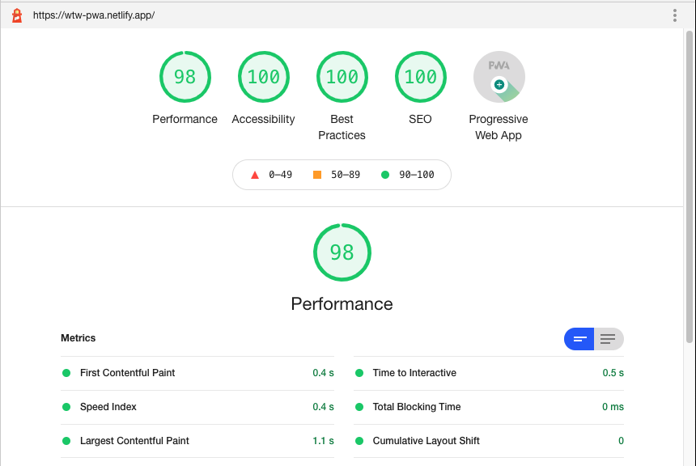
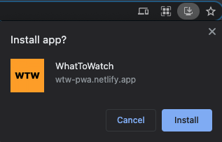

# Progressive Web Apps @cmda-minor-web · 20-21

A progressive web application with static site generation.

## Usage

Clone this repository:  
`git clone https://github.com/gv-minorweb/progressive-web-apps-2021.git`

Register an API key on themoviedb.org and create an `.env` file in the root directory with the following details:
```
API_URL=https://api.themoviedb.org/3/
API_KEY=$YOUR_API_KEY
```

Optionally change configuration options such as source and dist directories/paths in `/config/config.js`. The config directory also hosts all development and production tasks that are called from `webpack.*.js` from the root.

The default working directory is `src` and the output/build directory is `dist`.

### Development
In development mode files are written to memory.

- `npm run start`

### Production
In production CSS and JS files are minified.

- `npm run build`  
_Generates static HTML files and outputs them into `dist` directory._

It's also possible to build just static files, HTML files or watch them with one of the commands in the `package.json` file:

```
"scripts": {
  "prestart": "npm run build:html",
  "start": "webpack serve --config webpack.dev.js",
  "poststart": "npm run watch:html",
  "build": "npm-run-all build:*",
  "build:static": "webpack --config webpack.prod.js",
  "build:html": "node config/tasks/common/html.js",
  "serve": "serve dist",
  "watch": "run-p watch:*",
  "watch:html": "chokidar 'src/server/views/**/*.njk' --command 'npm run build:html'",
  "watch:static": "chokidar 'src/client/**/*' --command 'npm run build:static'",
}
```

## Project structure

Initially this project started as a server side application, so all HTML files still reside in the `server` directory, mainly `server/views`.

For the HTML I use [Nunjucks](https://mozilla.github.io/nunjucks/) as templating engine.

For the styles I use SASS, although for the purpose of this application the css isn't split up in separate files.

I've built this application with scalability in mind, splitting up development and production tasks/files for optimal build times. As mentioned earlier, during development files are written to memory and are not minified, for production they are.

Each task lives in its own file, i.e. a separate css build task for both development and production where minification settings are configured.

```js
.
├── config/
│   ├── tasks/
│   │   ├── common // Tasks used for both dev & production
│   │   ├── dev
│   │   └── prod
│   ├── utils
│   └── config.js // Main project configuration
├── src/
│   ├── client // JS, CSS and static assets/
│   │   ├── fonts
│   │   ├── images
│   │   ├── js
│   │   ├── styles
│   │   └── manifest.json
│   └── server/
│       └── views/
│           ├── components // Atomic design components
│           ├── pages // Pages built up from components
│           ├── partials // Head/footer
│           └── templates // Template wrapper used around pages
├── webpack.common.js // Common webpack config used by both dev & production
├── webpack.dev.js // Extends common config
├── webpack.prod.js // Extends common config
└── package.json
```


## Optimized application

Webpack is used to build, bundle and optimize all files. With the exception of the HTML files that are statically generated using Node.

By optimizing/minifying static files such as CSS and JavaScript I was able to get great scores across the board when running Lighthouse in Google Chrome. Having said that, the application as it stands is already very small in the first place, so these optimizations may not be noticable.

External (large) images that I have no control over take some time to download. If I were to actually push this application to production I would want to download and save all external images locally, then optimize them during the build process and serve only small image files.



## Progressive Web App



This is a Progressive Web App, meaning it's installable, files are cached and served offline where possible. Since all detail pages are statically generated with an `index.html` file, those are also available offline (i.e. `/movie/337404/index.html`).

```js
const PRECACHE_URLS = [
  'index.html',
  './', // Alias for index.html
  '/assets/css/main.css',
  'main.js'
];
```